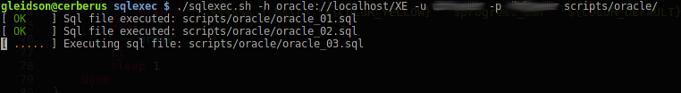
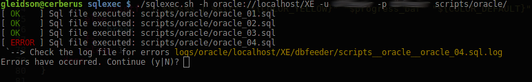
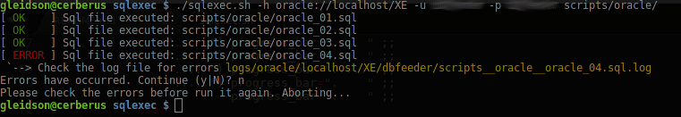

# sqlexec

A shell script to execute sql files that are in a directory and show a progress bar. 
It supports Oracle, MySQL/MariaDB and PostgreSQL.






## Examples:

### Oracle:
```
$ sqlexec.sh -h oracle://localhost/XE -u test_user -p t3stP4ss0rd scripts/oracle
```
```
$ sqlexec.sh -h oracle://localhost:1521/XE -u test_user -p t3stP4ss0rd scripts/oracle
```

### MySQL:
```
$ sqlexec.sh -h mysql://10.20.40.5/testdb -u test_user -p t3stP4ss0rd scripts/mysql
```
```
$ sqlexec.sh -h mysql://10.20.40.5:3306/testdb -u test_user -p t3stP4ss0rd scripts/mysql
```

### PostgreSQL:
```
$ sqlexec.sh -h postgresql//localhost/testdb -u test_user -p t3stP4ss0rd scripts/postgresql
```
```
$ sqlexec.sh -h postgresql//localhost:5432/testdb -u test_user -p t3stP4ss0rd scripts/postgresql
```